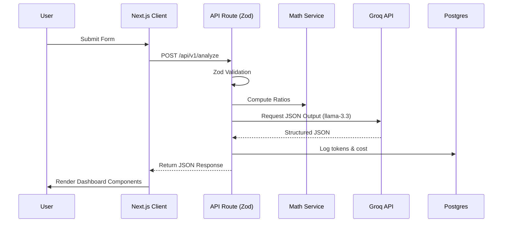

# System Architecture & Technical Design

## 1. Overall Application Architecture
Knowith Capital AI operates on a robust MVC-inspired layered architecture built over Next.js App Router.
- **Client**: React Server Components (RSC) and Client Components for dynamic UIs.
- **Edge API Gateway**: Next.js API Routes acting as the BFF (Backend for Frontend).
- **Service Layer**: Pure TypeScript classes for business logic, math, and AI orchestration.
- **Data Layer**: Prisma ORM connecting to a managed PostgreSQL instance.
- **LLM Inference**: Groq API for ultra-fast LLaMA inference.

## 2. Folder Structure
```
/src
  /app                  # Next.js App Router (Pages & API Routes)
    /api/v1             # Versioned REST APIs
  /components           # Reusable UI components
  /lib
    /ai                 # Prompt management, Groq clients, orchestration
    /db                 # Prisma client and migrations
    /math               # Deterministic financial calculators
    /services           # Core business logic (LeadRouter, etc.)
  /schemas              # Zod schemas for input/output validation
  /types                # TypeScript definitions
  /utils                # Loggers, rate limiters, feature flags
```

## 3. Database ERD (PostgreSQL + Prisma)
```prisma
model User {
  id            String    @id @default(uuid())
  email         String    @unique
  profile       Profile?
  sessions      Session[]
}

model Profile {
  id            String    @id @default(uuid())
  userId        String    @unique
  riskAppetite  String?
  // other deterministic fields
}

model Session {
  id            String    @id @default(uuid())
  userId        String
  feature       String    // e.g., 'ADVISOR', 'HEALTH'
  messages      Message[]
  tokenUsage    Int       @default(0)
  costUSD       Float     @default(0.0)
}

model Message {
  id            String    @id @default(uuid())
  sessionId     String
  role          String    // USER, ASSISTANT, SYSTEM
  content       Json      // Structured JSON output support
  feedback      Int?      // 1 (Thumb up), -1 (Thumb down)
}
```

## 4. Authentication Flow
- Implementation via **NextAuth.js (Auth.js)**.
- JWT-based session strategy for stateless API scaling.
- OAuth providers (Google) + Email Magic Links.

## 5. API Conventions
- Standardized Response Format: `{ success: boolean, data?: any, error?: { code, message } }`.
- Status codes: 200 (OK), 400 (Bad Request - Validation), 401 (Unauthorized), 429 (Rate Limited).

## 6. AI Orchestration & Structured Output
- **Structured AI Responses**: Groq API is strictly called using `response_format: { type: "json_object" }` where possible, or function calling. The UI expects structured JSON (e.g., `{ analysis: "", risk_score: 80, missing_info: [] }`) instead of parsing free-form Markdown.
- **Prompt Versioning**: Prompts are stored in DB or version-controlled JSON files. Every `Session` records the `promptVersionId` used.

## 7. Deployment Architecture
- **Frontend/BFF**: Vercel (Edge network for streaming).
- **Database**: Supabase or Neon (Serverless PostgreSQL).
- **Caching**: Upstash Redis (Rate limiting and prompt caching).

## 8. Observability & Logging
- **Logger**: Winston or Pino. Logs streamed to Datadog/Axiom.
- **Token Usage & Cost Tracking**: Every Groq API response contains `usage`. This is parsed and saved to the `Session` model. Cost is calculated per token and logged to Grafana.

## 9. Feature Flags
- Configured via LaunchDarkly or Vercel Edge Config.
- Example: `ENABLE_LEAD_GEN=true`, `USE_LLAMA_3_3=true`.

## 10. AI Evaluation & Feedback Loop
- **Thumbs Up/Down**: UI includes feedback buttons on AI messages. Updates the `feedback` column in the `Message` table.
- **Human-in-the-Loop (HITL)**: Messages with -1 feedback are flagged in the admin dashboard for prompt refinement.

## 11. Testing & CI/CD
- **Unit Testing**: Jest for deterministic math (SIP, Tax).
- **E2E Testing**: Playwright for critical paths.
- **CI/CD**: GitHub Actions. Pre-commit hooks for Lint/Prettier. Deploy preview on PR, Production on `main`.

## 12. Sequence Diagram (Typical AI Request)

